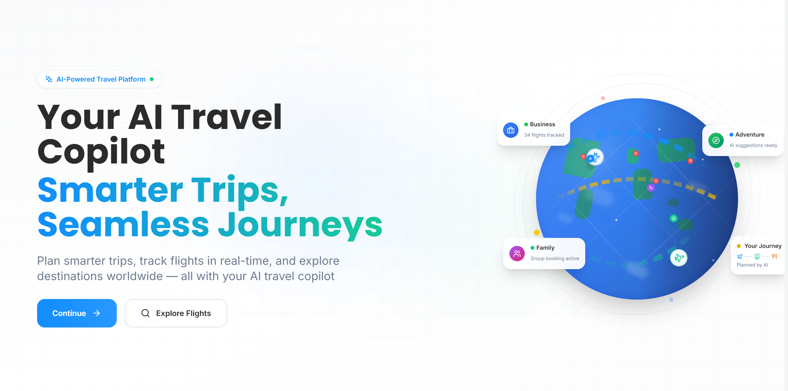

# ✈️ SkyNeu — AI-Powered Travel & Aviation Platform

SkyNeu is a full-featured travel companion web app that combines **flight search, live flight tracking, AI-powered trip planning, destination discovery, visa checking, and aviation education** into a single platform. Built with React, TypeScript, and Appwrite, it's designed to make travel planning smarter, faster, and more enjoyable.

---
<div align="center">


### ✈️ AI-Powered Travel & Aviation Platform

[](https://skyneu.com)
[](https://react.dev)
[](https://www.typescriptlang.org/)
[](https://vitejs.dev)
[](https://appwrite.io)

</div>

SkyNeu is a full-featured travel companion web app that combines **flight search, live flight tracking, AI-powered trip planning, destination discovery, visa checking, and aviation education** into a single platform. Built with React, TypeScript, and Appwrite, it's designed to make travel planning smarter, faster, and more enjoyable.

<p align="center">
  
</p>

---

## 🌟 Overview

Modern travel planning is fragmented across dozens of apps and tabs — one for flights, another for visas, another for itineraries, another for "things to do." SkyNeu brings all of that into one cohesive experience, layered with AI assistance (via Gemini and Perplexity/Sonar) to help travelers make better decisions faster.

The app is built as a **Vite + React + TypeScript SPA**, backed by **Appwrite** for auth, database, and serverless functions, with additional **Node/Express proxy servers** for secure third-party API access.

🔗 **Live demo:** [skyneu.com](https://skyneu.netlify.app/)

---

## 🚀 Key Features

### ✈️ Flight Search & Tracking
- Search flights across routes with rich filtering (price, stops, airlines, times)
- Real-time **flight tracking** with live status, delays, and route maps (via Leaflet)
- **Flight news & alerts** for tracked flights
- Pin and share flights with others via shareable flight cards
- Aviation data sourced from AviationStack / Aviation Edge with a backend enrichment proxy

### 🧠 AI Trip Planner & Assistant
- Enhanced **AI Trip Planner** powered by Gemini for generating personalized itineraries
- Conversational **AI Chat Assistant** for travel-related Q&A
- AI-generated **travel checklists** tailored to destination, duration, and trip type
- **Price prediction** insights for flights

### 🌍 Discovery & Trip Management
- **Discovery page** for exploring destinations, attractions, and travel guides
- Full **trip planner** with collaborative trips, trip members, activities, expenses, and checklists
- **Guest trip access** via shareable join codes — no account required
- Trip detail pages with itinerary breakdowns and expense tracking

### 🛂 Visa Checker
- AI-assisted visa requirement lookups between countries (via Perplexity/Sonar)

### 📚 Aviation Education Hub
- In-depth guides on aircraft, airports, and aviation concepts
- Aviation news, travel advisories, and educational resources
- Interactive **aviation quizzes**

### 👤 Accounts, Notifications & Subscriptions
- Authentication via **Appwrite** (including OAuth success/failure flows)
- User profiles and preferences
- In-app **notifications** with auto-checking for flight status changes
- **Premium subscription** tier with feature gating, powered by **Dodo Payments**

### 🛠️ Platform & Compliance
- Dark/light **theme support**
- SEO-optimized pages with dynamic meta tags and sitemap generation
- Legal pages: Privacy Policy, Terms of Use, Refund Policy, Cookie Policy, AI Use Policy
- Public roadmap, changelog, and feature request system
- Currency conversion and sustainability (carbon footprint) insights for flights

---

## 🏗️ Tech Stack

### Frontend
- **React 18** + **TypeScript**
- **Vite 5** — build tool & dev server
- **Tailwind CSS** + **MUI (Material UI)** + **Emotion** — styling
- **React Router v7** — routing
- **React Hook Form** + **Yup** — form handling & validation
- **React Leaflet** — interactive maps for flight tracking
- **React Datepicker**, **Luxon**, **date-fns** — date/time handling
- **Lucide React** & **Heroicons** — icon libraries
- **React Hot Toast** / **React Toastify** — notifications
- **React Markdown** + **Portable Text (Sanity)** — rich content rendering
- **html2canvas** + **jsPDF** — exporting shareable cards/PDFs

### Backend & Infrastructure
- **Appwrite** — authentication, database, storage, and serverless functions
- **Node.js / Express** — local proxy servers for flight search and Perplexity API calls
- **Sanity CMS** (`@sanity/client`, `next-sanity`) — content management for guides/articles
- **Dodo Payments** — subscription & payment processing

### Appwrite Functions (`/appwrite-functions`)
| Function | Purpose |
|---|---|
| `flight-search-proxy` | Secure server-side flight search API calls |
| `aviation-enrichment-proxy` | Enriches flight data with aviation provider info |
| `perplexity-search` | Proxies AI-powered visa/travel queries via Perplexity (Sonar) |
| `dodo-payments-handler` | Handles subscription payments & webhooks |
| `guest-access` | Manages guest trip join-code access |
| `public-card` | Generates publicly shareable flight/trip cards |
| `sitemap-generator` | Generates the site's XML sitemap for SEO |

---

## 📁 Project Structure

```
Skyneu-AI-Travel-Webapp/
├── appwrite-functions/      # Serverless backend functions (flight proxy, payments, etc.)
├── public/                  # Static assets, images, manifest, robots.txt
├── server/                  # Express proxy servers (flight search, Perplexity)
├── src/
│   ├── components/          # Reusable UI components (layout, auth, common, detail pages)
│   ├── config/              # App configuration
│   ├── contexts/            # React context providers (Auth, Theme, Notifications, etc.)
│   ├── data/                 # Static/seed data
│   ├── hooks/               # Custom React hooks
│   ├── lib/                  # Shared utilities/libraries
│   ├── pages/                # Route-level page components
│   │   ├── account/          # User profile pages
│   │   ├── flights/           # Flight search, tracker, news/alerts, shared flights
│   │   ├── notifications/     # Notifications center
│   │   └── others/            # Trip planner, trip details, guest trips
│   ├── services/             # API/service layer (flights, AI, trips, visas, etc.)
│   ├── types/                # TypeScript type definitions
│   ├── utils/                # Helper utilities
│   ├── App.tsx               # Root component & route definitions
│   └── main.tsx               # App entry point
├── .env.example              # Environment variable template
├── vite.config.ts
├── tailwind.config.js
└── package.json
```

---

## ⚙️ Getting Started

### Prerequisites
- Node.js (v18+ recommended)
- npm
- An Appwrite project (for auth, database, and functions)

### Installation

```bash
# Clone the repository
git clone https://github.com/Shaikh224/Skyneu-AI-Travel-Webapp.git
cd Skyneu-AI-Travel-Webapp

# Install dependencies
npm install
```

### Environment Setup

Copy `.env.example` to `.env` and fill in your own values:

```bash
cp .env.example .env
```

You'll need to configure:
- **Appwrite**: endpoint, project ID, database ID, collection IDs, and function IDs
- **Sanity**: project ID and dataset (for CMS content)
- **Provider API keys**: Gemini, Unsplash, NewsAPI, AviationStack, Aviation Edge, FR24, Sonar/Perplexity

### Running Locally

```bash
# Start the Vite dev server
npm run dev

# Run the Express flight-search/Perplexity proxy (if needed locally)
cd server && npm install && node server.js
```

### Build for Production

```bash
# Standard build
npm run build

# Build with sitemap generation
npm run build:full
```

### Linting

```bash
npm run lint
```

---

## 🔐 Security

This project follows strict guidelines around secret management — see [`SECURITY.md`](./SECURITY.md):
- `.env` files are never committed; only `.env.example` placeholders are tracked
- Provider secrets live in backend/Appwrite Function environments, not the browser bundle
- Keys must be rotated before making the repository public if they were ever stored locally

---

## 🗺️ Roadmap & Feedback

SkyNeu includes built-in pages for:
- **`/roadmap`** — upcoming features
- **`/changelog`** — release history
- **`/feature-requests`** — community feature suggestions

---

## 📄 License & Policies

- [Privacy Policy](./src/pages/PrivacyPolicy.tsx)
- [Terms of Use](./src/pages/TermsOfUse.tsx)
- [Refund Policy](./src/pages/RefundPolicyPage.tsx)
- [Cookie Policy](./src/pages/CookiePolicyPage.tsx)
- [AI Use Policy](./src/pages/AIUsePolicyPage.tsx)
- [Security Policy](./SECURITY.md)

---

## 👤 Author

Built by [**Shaikh224**](https://github.com/Shaikh224)
